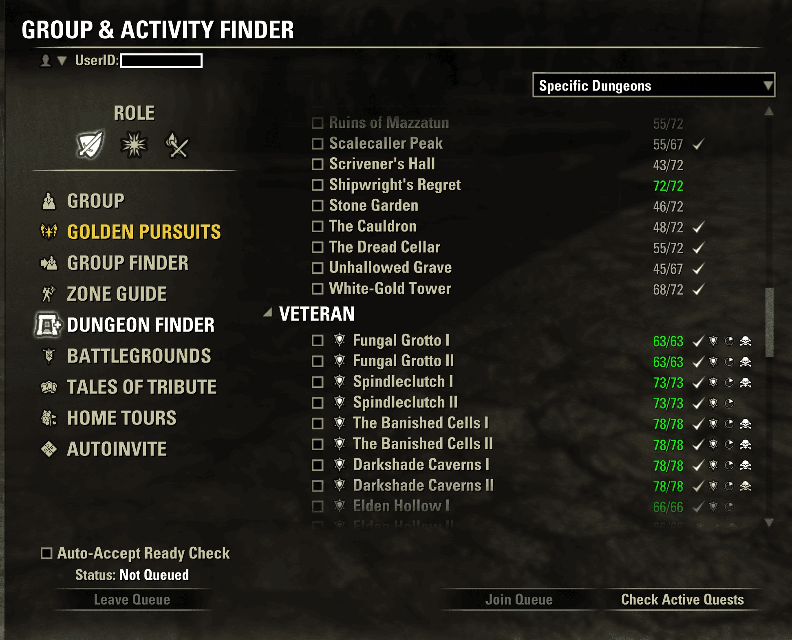

# Group Synergizer (Community Maintenance)

Community-maintained update of **[Group Synergizer](https://www.esoui.com/downloads/info2286-GroupSynergizer-EnhancedLFGFeaturesAutoAcceptQueBetterNotifications.html)** by **scorpius2k1**.

This fork is **not affiliated with the original author**. Maintenance is by **sivaDog**. We are seeking official maintainer handover on ESOUI for the [original addon page](https://www.esoui.com/downloads/info2286-GroupSynergizer-EnhancedLFGFeaturesAutoAcceptQueBetterNotifications.html).

## Features

- Enhanced sound and screen notifications for LFG ready checks
- Daily pledge and quest status in the Activity Finder
- Set collection progress per dungeon (optional, requires [LibSets](https://www.esoui.com/downloads/info2241-LibSets.html))
- Auto-accept ready checks (optional)
- Auto-release in battlegrounds (optional)
- Slash commands: `/pledge`, `/pl`, `/leave`, `/lv`, `/gs`

## Screenshots

Activity Finder (Dungeon Finder) with Group Synergizer enabled:

- **Pledge / Quest / Done** — daily pledge and quest completion next to each dungeon
- **Set collection** — unlocked/total pieces (e.g. `55/72`; green when complete), requires LibSets
- **Achievement icons** — veteran hard mode, trifecta, and no-death status
- **Auto-Accept Ready Check** — optional checkbox below the dungeon list
- **Check Active Quests** — button to verify active pledge quests in your journal

## Requirements

- [LibAddonMenu-2.0](https://www.esoui.com/downloads/info7-LibAddonMenu-2.0.html) (>= 34)
- [LibUndauntedPledges](https://www.esoui.com/downloads/info3314-LibUndauntedPledges.html)
- [LibSets](https://www.esoui.com/downloads/info2241-LibSets.html) (optional, for set collection progress)

## Installation

1. Install dependencies via Minion or manually from ESOUI.
2. Copy the `GroupSynergizer` folder into your `AddOns` directory.
3. Enable the addon in-game.

## Changes since ESOUI 4.1 (Necrom)

- Updated dungeon and pledge data for current patches
- Quest ID-based pledge tracking (replacing string matching)
- Integration with LibUndauntedPledges for pledge cycle detection
- Set collection progress in Activity Finder via LibSets
- Dungeon Finder crash fixes and UI stability improvements

## Credits

- **Original author:** [scorpius2k1](https://www.esoui.com/downloads/author-47149.html) (Group Synergizer 1.0–4.1)
- **Maintainer:** sivaDog
- **UI helpers:** Modified code from [Bandits User Interface](https://www.esoui.com/downloads/info1643-BanditsUserInterface.html) by Hoft, secretrob
- **Contributors:** See [git history](https://github.com/sivaDog/UnofficialGroupSynergizer/commits/main)

## Feedback

- In-game: Settings → Group Synergizer → Send Feedback
- GitHub: [Issues](https://github.com/sivaDog/UnofficialGroupSynergizer/issues)

## License

No license file was included with the original addon. This fork respects the original work and ESOUI community guidelines. Do not republish without proper attribution.
